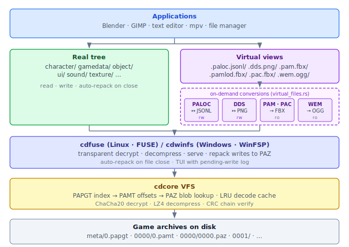

## Crates

| Crate | Platform | Description |
|-------|----------|-------------|
| [`cdcore`](#cdcore) | any | Rust library — VFS, parsers, crypto, audio, DDS; exposed to Python via PyO3 |
| ├─ [`cdfuse`](#cdfuse-linux--cdwinfs-windows) | Linux | FUSE filesystem mount for Crimson Desert archives |
| └─ [`cdwinfs`](#cdfuse-linux--cdwinfs-windows) | Windows | WinFSP filesystem mount for Crimson Desert archives (GPL-3.0) |

```bash
bash build.sh   # Linux
build.cmd       # Windows
```

These crates are unaffiliated companion tooling for the excellent
[CrimsonForge](https://github.com/hzeemr/crimsonforge) modding studio.
The archive formats, crypto, compression, mesh parsers, FBX export logic,
and virtual file designs are all derived directly from CrimsonForge's Python
implementation.

---

### `cdcore`

Rust library exposed to Python via [PyO3](https://pyo3.rs).
Used as a faster VFS and decoder backend for CrimsonForge. Add one line at
the top of `main.py` to activate:

```python
import cdcore  # monkeypatches vfs, dds reader and mesh reader with native implementations
```

The import injects three transparent proxies into `sys.modules`:

- `core.vfs_manager.VfsManager` → Rust VFS (PAPGT + PAMT + PAZ, parallel load, LRU cache)
- `core.dds_reader.decode_dds_to_rgba` → Rust DDS decoder (BC1-BC7, BC6H, float variants)
- `core.mesh_parser.parse_pam` / `parse_pamlod` → Rust mesh parsers (30–70× faster)

All other attributes on those modules fall through to the original Python
implementations, so cdcore can be adopted incrementally with no other code changes.

The wheel also exposes the underlying Rust API directly for use outside CrimsonForge:

```python
import cdcore

# VFS
vfs = cdcore.VfsManager("/path/to/crimson_desert")
vfs.load_group("0000")
entry = vfs.get_pamt("0000").file_entries[0]
data  = vfs.read_entry(entry)          # bytes: decrypted + decompressed

# DDS decode
width, height, rgba = cdcore.decode_dds_to_rgba(data)

# Mesh parsing
mesh = cdcore.parse_pam(data, "object/foo.pam")
for sub in mesh.submeshes:
    print(sub.name, len(sub.vertices), "verts")
```

---

### `cdfuse` (Linux) / `cdwinfs` (Windows)

Filesystem that mounts Crimson Desert archives as a browsable directory tree.
Files are transparently decrypted and decompressed on access.
Supports read-write: edit files in place or drag-and-drop replacements.
By default, closing a modified file immediately repacks it into the PAZ archives
in the background. Pass `--no-auto-repack` to disable this and use `[s]` to
flush manually instead.


| Crate | Platform | Driver | License | Requirement |
|-------|----------|--------|---------|-------------|
| `cdfuse` | Linux | FUSE via `fuser` | MIT | `libfuse3`, `user_allow_other` in `/etc/fuse.conf` |
| `cdwinfs` | Windows | [WinFsp](https://winfsp.dev/rel/) | GPL-3.0 | WinFsp 2.x installed |

`cdwinfs` is GPL-3.0 because `winfsp-rs` (the Rust WinFSP bindings) declares
GPL-3.0. The underlying WinFSP driver has a FLOSS exception; replacing the
binding crate with hand-generated bindgen output would allow relicensing to MIT.
<details>
<summary>Architecture diagram</summary>



</details>


**First launch — interactive setup:**

Both tools save their configuration (`~/.config/cdfuse/cdfuse.cfg` on Linux,
`%APPDATA%\CrimsonForge\cdwinfs.cfg` on Windows) so they can be launched without
arguments on subsequent runs.

On first launch (no saved config, no CLI args) a configuration screen appears:

```
  Game directory:  /cd              (detected)    [g] browse
  Mount point:     /media/max/cd                  [m] edit
```

The game directory is detected automatically from the registry (Windows) or common
install paths. Missing fields are shown in red. Press `Enter` to mount once both
are filled.

**CLI usage:**
```bash
cdfuse [GAME_DIR] [MOUNT]          # Linux — args override saved config
cdwinfs.exe [GAME_DIR] [DRIVE]     # Windows — DRIVE is a single letter, e.g. Y
cdfuse --licenses                  # print third-party dependency licenses
```

**TUI while mounted:**
```
  [s] flush pending writes to PAZ    Esc quit [without saving]
```
- `(ro)` shown in yellow if mounted read-only
- Events panel appears below when repacks complete or fail

**Archive tree:**
```
/media/max/cd/     (Linux)    Y:\    (Windows)
  character/
    cd_phm_basic_00_00_roofclimb_base_std_lantern_b_7_ing_00.paa
    cd_r0002_00_horse_hair_mane_00_0002_index05.prefab
  gamedata/
    localizationstring_eng.paloc
    actionpointinfo.pabgb
  object/
    cd_gimmick_statue_09_ball.pam
  ui/
    bitmap_bell.dds
```

**Virtual read-only views:**

Hidden root directories expose binary files in more usable formats without
modifying the archives:

```
.paloc.jsonl/gamedata/localizationstring_eng.paloc.jsonl   (localisation text)
.dds.png/ui/bitmap_bell.dds.png                            (textures as PNG)
.pam.fbx/object/cd_gimmick_statue_09_ball.pam.fbx          (static mesh as FBX)
.pamlod.fbx/character/cd_phm_basic_body.pamlod.fbx         (LOD mesh as FBX)
.pac.fbx/character/cd_phm_basic_body.pac.fbx               (skinned mesh as FBX)
.wem.ogg/sound/nhm_adult_noble_1_questdialog_hello_00000.wem.ogg  (audio as OGG)
```

`.paloc.jsonl/` and `.dds.png/` support write-back: saving a file converts it
back to the original binary format and repacks it automatically.

`.wem.ogg/` is handled entirely in Rust by `cdcore::formats::audio` — no
external tools required. OGG conversion is on-demand and lossless.

The FBX exporter is a Rust port of CrimsonForge's `mesh_exporter.py`, producing
binary FBX 7.4 files compatible with Blender, Maya, and Unreal.

```bash
# Edit German localisation
$EDITOR /media/max/cd/.paloc.jsonl/gamedata/localizationstring_ger.paloc.jsonl

# Edit a texture (save as PNG; repacked to original DDS format automatically)
krita /media/max/cd/.dds.png/ui/bitmap_bell.dds.png

# Open a mesh in Blender
blender /media/max/cd/.pam.fbx/object/cd_gimmick_statue_09_ball.pam.fbx

# Play a voice line
mpv /media/max/cd/.wem.ogg/sound/nhm_adult_noble_1_questdialog_hello_00000.wem.ogg
```

---

## Release artifacts

Each tagged release on GitHub attaches:

| File | Description |
|------|-------------|
| `cdcore-X.Y.Z-cp312-cp312-manylinux_2_17_x86_64.manylinux2014_x86_64.whl` | cdcore wheel — Linux x86-64 |
| `cdcore-X.Y.Z-cp312-cp312-win_amd64.whl` | cdcore wheel — Windows x86-64 |
| `cdfuse` | cdfuse binary — Linux (MIT) |
| `cdwinfs.exe` | cdwinfs binary — Windows (GPL-3.0) |

Third-party dependency licenses are embedded in each binary (`--licenses` flag)
and in the cdcore wheel (`THIRD_PARTY_LICENSES.md`).

Install the cdcore wheel:
```bash
pip install cdcore-*.whl
```

## Build requirements

- Rust 1.70+
- Python 3.10+ with `libpython3.x-dev` (`apt install libpython3-dev`) — pyo3 links against libpython at compile time
- [maturin](https://github.com/PyO3/maturin) 1.0+ (`pip install maturin`) — builds the cdcore wheel
- `cargo-license` (`cargo install cargo-license`) — generates third-party license files during build
- **Linux:** `libfuse3-dev` (`apt install libfuse3-dev`) — cdfuse links against libfuse3 at compile time
- **Windows:** LLVM/clang for `winfsp-sys` bindgen — pre-installed on `windows-latest` CI runners; locally install from [llvm.org](https://releases.llvm.org/)

## Runtime requirements

- `cdcore` wheel: Python 3.10+, no other native dependencies
- `cdfuse` (Linux): `libfuse3` (`apt install libfuse3`), `user_allow_other` in `/etc/fuse.conf`
- `cdwinfs` (Windows): [WinFsp 2.x](https://winfsp.dev/rel/) installed — the installer registers the DLL path; `cdwinfs.exe` finds it automatically
- Audio virtual view (`.wem.ogg/`): no external tools — handled by `cdcore::formats::audio`
