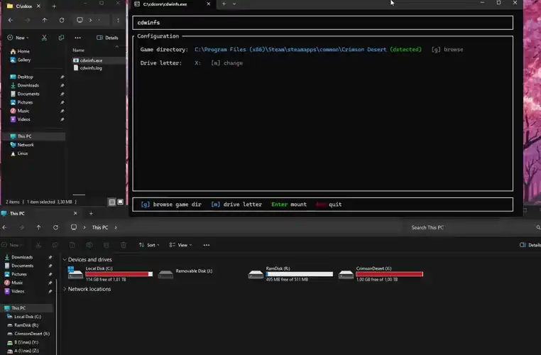
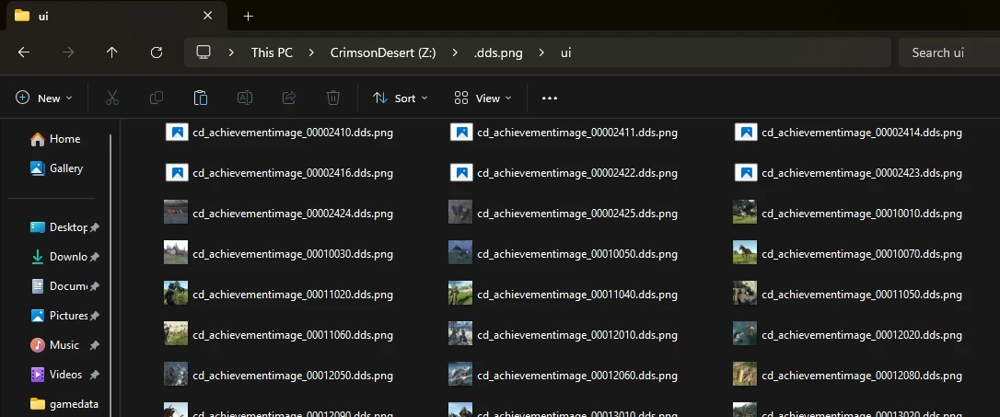

# cdwinfs

Mounts Crimson Desert archives as a Windows drive (default `Z:\`). 
Browse them in Explorer, open them in your usual editor, save, and the change is repacked into the game.



## Quick start

1. Install **WinFsp** from <https://winfsp.dev/rel/> (next-next-finish).
2. Extract this zip somewhere stable, e.g. `C:\Tools\cdwinfs\`.
3. Double-click **`cdwinfs.exe`**.

A small setup window opens:

```
  Game directory:  C:\Program Files (x86)\Steam\steamapps\common\Crimson Desert  (detected)
  Mount point:     Z                                                              [m] edit
```

The Crimson Desert install path is detected from the Steam registry where
possible. If you press **Enter**, the drive mounts and a `Z:\` shortcut
appears in **This PC** in Explorer.

## Using the mount

Open `Z:\` in Explorer. The game's archive tree is laid out as ordinary folders:



```
Z:\
  character\
    cd_phm_basic_00_00_roofclimb_base_std_lantern_b_7_ing_00.paa
  gamedata\
    localizationstring_eng.paloc
    actionpointinfo.pabgb
  object\
    cd_gimmick_statue_09_ball.pam
  ui\
    bitmap_bell.dds
```

You can copy files out, run them through tools, and so on -- all read
operations work like a normal drive.

### Editing in familiar formats

Some game formats (`.paloc`, `.dds`, `.pam`, `.pamlod`, `.pac`, `.wem`) are
binary and not directly editable. Hidden root folders expose them in
editable formats:

| Hidden folder | Format | Editor |
|---------------|--------|--------|
| `Z:\.paloc.jsonl\`  | JSON-lines text       | Notepad, VS Code |
| `Z:\.dds.png\`      | PNG image             | Paint.NET, GIMP, Photoshop |
| `Z:\.pam.fbx\`      | static mesh, FBX      | Blender |
| `Z:\.pamlod.fbx\`   | LOD mesh, FBX         | Blender |
| `Z:\.pac.fbx\`      | skinned mesh, FBX     | Blender |
| `Z:\.wem.ogg\`      | OGG audio             | VLC, Windows Media Player |

So instead of `gamedata\localizationstring_eng.paloc` (binary), you open
`Z:\.paloc.jsonl\gamedata\localizationstring_eng.paloc.jsonl` (text).

(if they dont show, enable **View → Show → Hidden items** to see them)

Most virtual views are read-only for now.
**Saving repacks back to the game.** When you save through `.paloc.jsonl\`
or `.dds.png\`, the file is converted back to binary and written into the
original archive. 

Voice-over languages live in separate package groups, so `sound\` shows up
multiple times:

- `Z:\sound@0005\` -- Korean
- `Z:\sound@0006\` -- English
- `Z:\sound@0035\` -- Japanese

### While mounted

A small status window stays open showing mount state and any repack
events. Close that window (or press **Esc**) to unmount the drive.

---
<details>
<summary><b>Advanced</b></summary>


### Files in this download

| File | Purpose |
|------|---------|
| `cdwinfs.exe`              | the application |
| `LICENSE`                  | GPL-3.0 |
| `THIRD_PARTY_LICENSES.md`  | dependency notices |
| `README.md`                | this file |

### Verifying the download

A `cdwinfs.zip.sha256` sidecar lives next to the zip on the GitHub release
page. To verify:

```cmd
certutil -hashfile cdwinfs.zip SHA256
```

Compare the printed hash against the sidecar.

Every release also publishes a SLSA build provenance attestation. With
the GitHub CLI installed:

```cmd
gh attestation verify cdwinfs.zip --owner Rothfeld
```

### Command-line options

```
cdwinfs.exe <GAME_DIR> <DRIVE>      Skip the setup window and mount directly
cdwinfs.exe --readonly              Mount read-only (no repacks)
cdwinfs.exe --preload               Load every package group up front
cdwinfs.exe --groups 0000,0005      Load only the listed groups
cdwinfs.exe --no-auto-repack        Don't repack a file when it's closed
cdwinfs.exe --licenses              Print third-party licenses and exit
```

Example:

```cmd
cdwinfs.exe "C:\Program Files (x86)\Steam\steamapps\common\Crimson Desert" Z
```

</details>

---

## License

GPL-3.0. See `LICENSE`. The license is inherited from `winfsp-rs`, the
Rust WinFSP bindings this crate links against.

## Source and issues

<https://github.com/Rothfeld/cdcore>
