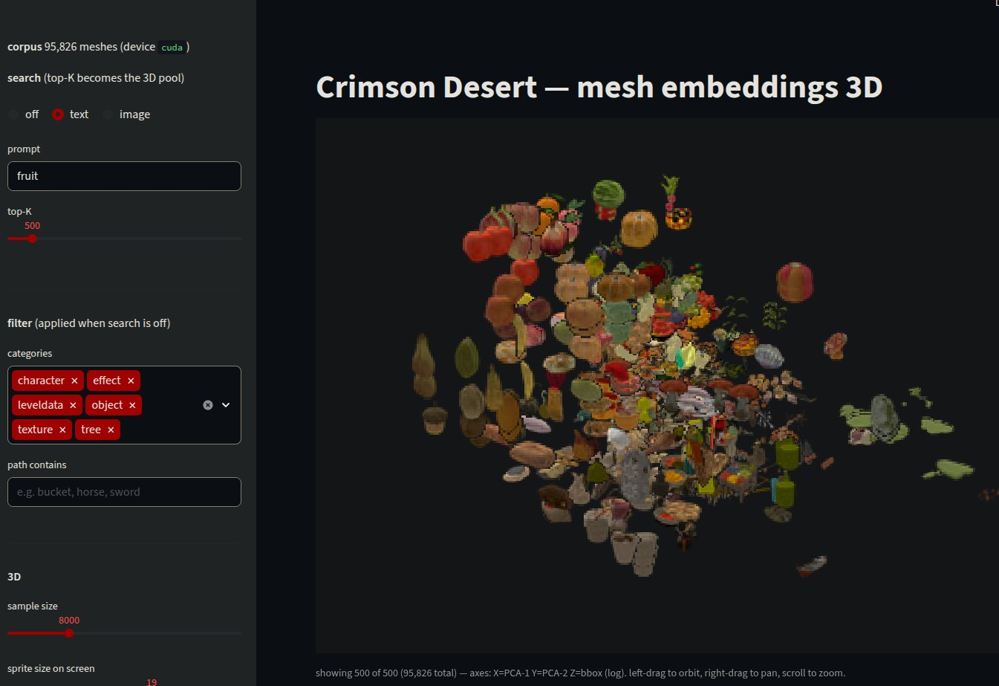

# mesh_search -- CLIP-based search over the CD mesh corpus



## Install

```bash
pip install -r crates/scripts/mesh_search/requirements.txt
```

Also needs the in-tree `cdcore` python module and a Crimson Desert
package directory on disk (`/cd` in this dev container).

## Build

```bash
python crates/scripts/mesh_search/build_corpus.py /cd
```

Output: `.corpus/corpus.safetensors` next to the script (~30 min for ~96k
meshes). Each mesh contributes:

  - `views`     `[N, 12, 512]` float32 -- L2-normed CLIP image features,
    one per fibonacci-sphere view rendered at 224x224 by `lib/raster.py`.
  - `mean`      `[N, 512]`              -- mean-pool of `views`, L2-normed.
  - `thumbs`    `[N, 32, 32, 4]` uint8  -- alpha-aware RGBA thumbnail
    (a 13th hand-picked front-3/4 angle, downsampled with the alpha
    mask along).
  - `bbox_diag` `[N]` float32           -- bbox diagonal, used as an
    optional 3D axis in viz.py.
  - `metadata["meta"]` JSON: VFS paths, model id, build params.

Plus per-mesh 224x224 PNGs at `thumbnails/<vfs_path>.png`.

## Run

```bash
streamlit run crates/scripts/mesh_search/viz.py
```

Sidebar:

  - **search** -- text or image query. Images go through rembg by default
    so the query bg matches the corpus's render bg.
  - **filter** -- category multiselect + path substring. Search runs
    within the filter.
  - **3D** -- sample size, sprite scale, X/Y/Z axis source (PCA-1/2/3
    or `bbox` / `bbox(log)`).

Top-10 disk thumbnails sit under the 3D scatter, captioned with VFS path
and cosine score.

## How queries score

Both modes encode the query through the same CLIP ViT-B/32. The sidebar
**score mode** toggle picks one of:

```
max   :  sim_i = max_v cos(query, view_v[i])    # best of 12 angles
mean  :  sim_i = cos(query, mean[i])            # cos vs mean-pooled prototype
```

`max` (default) suits single-angle queries -- a photo or a one-view
mesh excerpt -- where one specific stored view aligns. `mean` is
viewpoint-robust: clusters tighten around mesh categories. Top-K from
the chosen mode becomes the 3D pool.

